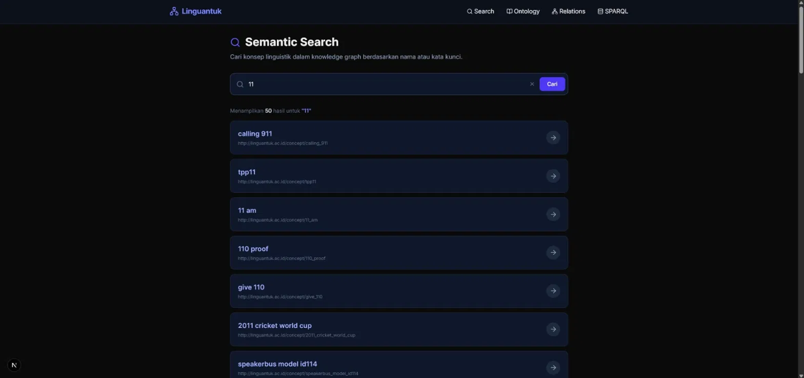
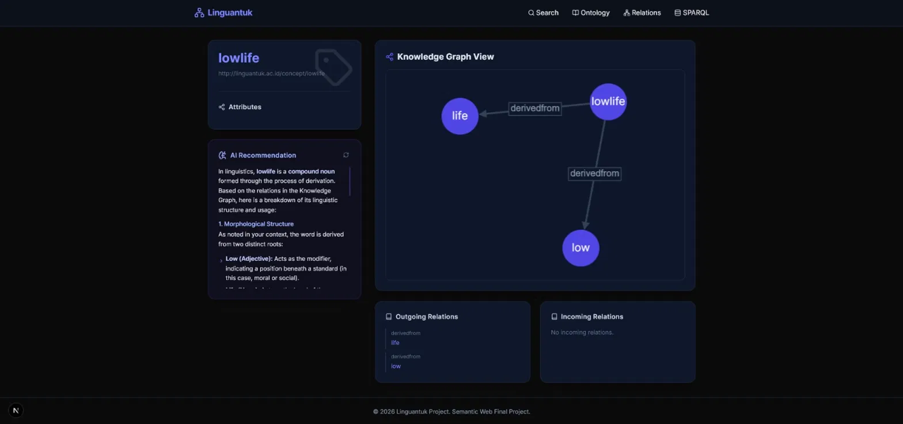
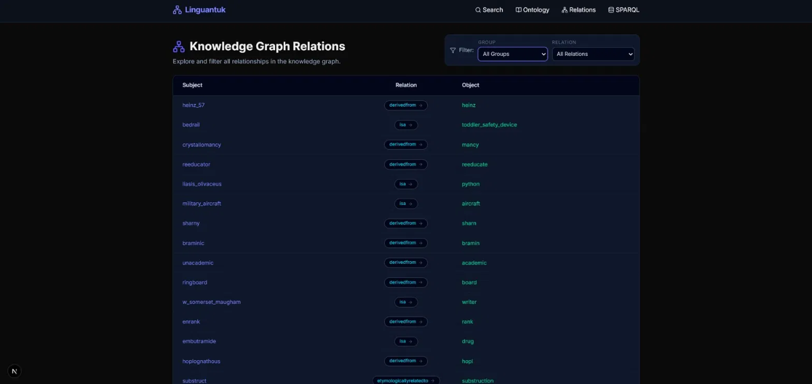
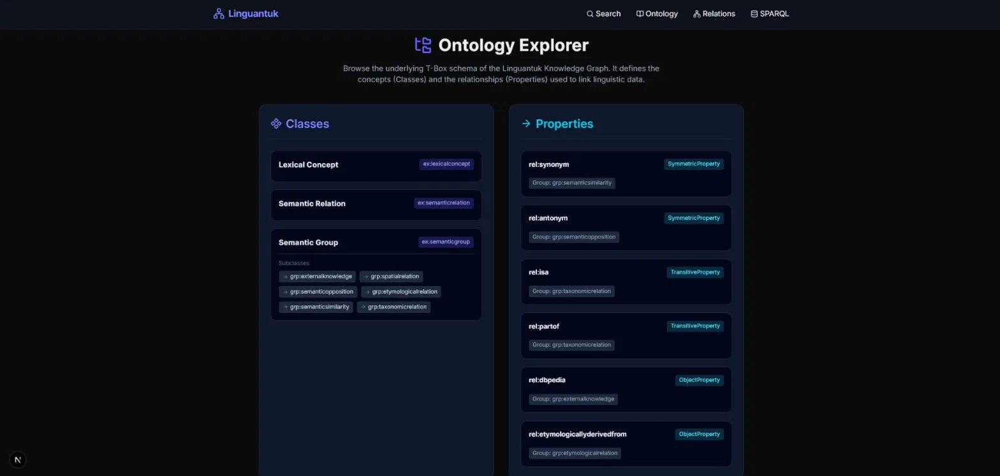
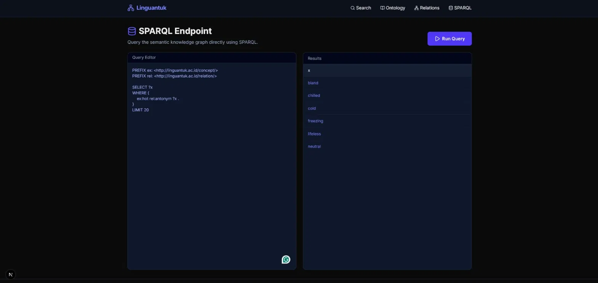
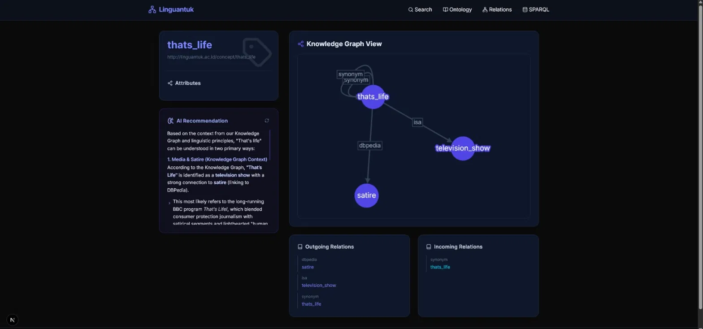

# 🌐 Linguantuk — Semantic Web Knowledge Graph

**Proyek Akhir Mata Kuliah Semantic Web**

Linguantuk adalah aplikasi web fullstack berbasis teknologi Semantic Web yang memungkinkan eksplorasi konsep linguistik melalui *knowledge graph* RDF. Aplikasi ini menyajikan fitur pencarian semantik, visualisasi graf relasi, browser ontologi, penelusuran relasi, query SPARQL interaktif, dan rekomendasi berbasis AI (Gemini).

---

## 📋 Daftar Isi

- [Fitur Utama](#-fitur-utama)
- [Arsitektur Sistem](#-arsitektur-sistem)
- [Struktur Direktori](#-struktur-direktori)
- [Prasyarat](#-prasyarat)
- [Instalasi & Menjalankan](#-instalasi--menjalankan)
- [Panduan Pengguna](#-panduan-pengguna)
- [Contoh Hasil](#-contoh-hasil)
- [Konfigurasi](#-konfigurasi)
- [API Endpoint](#-api-endpoint)
- [Ontologi](#-ontologi)
- [File yang Diabaikan (gitignore)](#-file-yang-diabaikan-gitignore)
- [Teknologi yang Digunakan](#-teknologi-yang-digunakan)

---

## ✨ Fitur Utama

| Fitur | Deskripsi |
|---|---|
| **Semantic Search** | Cari konsep linguistik dalam knowledge graph secara real-time |
| **Entity Detail** | Lihat seluruh properti dan relasi suatu entitas (incoming & outgoing) |
| **Graph Visualizer** | Visualisasi interaktif relasi antar entitas menggunakan Cytoscape.js |
| **Ontology Explorer** | Jelajahi skema T-Box (kelas dan properti) dari ontologi Linguantuk |
| **Relations Browser** | Tampilkan seluruh relasi knowledge graph dengan filter ontologi & paginasi |
| **SPARQL Endpoint** | Jalankan query SPARQL secara langsung terhadap knowledge base RDF |
| **AI Recommendation** | Generate penjelasan konsep linguistik menggunakan Google Gemini API |

---

## 🏗️ Arsitektur Sistem

```
Pengguna (Browser)
       │
       ▼
┌─────────────────────────┐
│  Frontend (Next.js 16)  │  → http://localhost:3000
│  React + TailwindCSS    │
└────────────┬────────────┘
             │ HTTP / Axios
             ▼
┌─────────────────────────┐
│  Backend (FastAPI)      │  → http://localhost:8000
│  Python + rdflib        │
└────────────┬────────────┘
             │
     ┌───────┴────────┐
     ▼                ▼
knowledge_graph.ttl   Google Gemini API
(RDF Turtle, ~20MB)   (AI Recommendation)
```

---

## 📁 Struktur Direktori

```
linguantuk/
├── backend/                    # Python FastAPI Backend
│   ├── main.py                 # Entry point API + semua endpoint
│   ├── kg_engine.py            # Engine query RDF (rdflib)
│   ├── knowledge_graph.ttl     # ⚠️ File data utama (tidak di-push ke git)
│   ├── requirements.txt        # Dependensi Python
│   ├── .env                    # ⚠️ API Key (tidak di-push ke git)
│   ├── .env.example            # Template konfigurasi env
│   └── scripts/
│       └── generate_data.py    # Script untuk generate data sample (data.ttl)
│
├── frontend/                   # Next.js 16 Frontend
│   ├── src/
│   │   ├── app/
│   │   │   ├── layout.tsx      # Root layout + navigasi global
│   │   │   ├── page.tsx        # Halaman utama (search bar)
│   │   │   ├── search/         # Halaman hasil pencarian
│   │   │   ├── entity/[id]/    # Halaman detail entitas
│   │   │   ├── ontology/       # Halaman browser ontologi
│   │   │   ├── relations/      # Halaman browser relasi + filter + paginasi
│   │   │   └── sparql/         # Halaman SPARQL editor
│   │   └── components/
│   │       ├── GraphVisualizer.tsx   # Komponen visualisasi graf (Cytoscape)
│   │       └── MarkdownRenderer.tsx  # Komponen render output Gemini AI
│   ├── package.json
│   └── tsconfig.json
│
├── ontology_schema.ttl         # Skema ontologi T-Box (OWL)
├── run_project.bat             # Script untuk menjalankan frontend + backend sekaligus
├── .gitignore                  # File yang dikecualikan dari git
└── README.md                   # Dokumentasi ini
```

---

## 🔧 Prasyarat

Pastikan perangkat Anda telah menginstal:

- **Python** `>= 3.9`
- **Node.js** `>= 18.x`
- **npm** `>= 9.x`
- **Google Gemini API Key** (gratis di [Google AI Studio](https://aistudio.google.com/app/apikey))
- File `knowledge_graph.ttl` (diperoleh secara terpisah, tidak termasuk dalam repo)

---

## 🚀 Instalasi & Menjalankan

### Clone Repository

```bash
git clone https://github.com/<username>/linguantuk.git
cd linguantuk
```

### 1. Setup Backend

```bash
cd backend

# (Opsional) Buat virtual environment
python -m venv venv
venv\Scripts\activate    # Windows
# source venv/bin/activate  # Mac/Linux

# Install dependensi
pip install -r requirements.txt

# Buat file .env dari template
copy .env.example .env
# Lalu edit .env dan isi GEMINI_API_KEY

# Letakkan file knowledge_graph.ttl di folder backend/
```

### 2. Setup Frontend

```bash
cd frontend
npm install
```

### 3. Menjalankan Aplikasi

**Cara cepat (Windows)** — jalankan dari root project:

```bat
run_project.bat
```

Atau jalankan secara terpisah:

```bash
# Terminal 1 — Backend
cd backend
python main.py

# Terminal 2 — Frontend
cd frontend
npm run dev
```

Akses aplikasi di:
- **Frontend:** http://localhost:3000
- **Backend API Docs:** http://localhost:8000/docs

> ⚠️ **Catatan:** Backend memerlukan waktu beberapa menit untuk startup karena harus memuat `knowledge_graph.ttl` (~20MB, 880.000+ triple) ke memori.

---
## 📖 Panduan Pengguna

Bagian ini menjelaskan cara menggunakan setiap fitur Linguantuk dari sisi pengguna, tanpa perlu memahami detail teknis backend.

### 1. Semantic Search

1. Buka halaman utama (`http://localhost:3000`).
2. Ketik kata kunci pada kolom pencarian (misalnya: `happy`, `car`, `goal`).
3. Sistem akan menampilkan daftar konsep yang cocok secara real-time.
4. Klik salah satu hasil untuk membuka halaman detail entitas tersebut.

### 2. Entity Detail & Graph Visualizer

1. Pada halaman detail entitas, Anda akan melihat:
   - **Attributes** — informasi dasar mengenai konsep.
   - **Outgoing Relations** — relasi yang berasal dari konsep ini ke konsep lain.
   - **Incoming Relations** — relasi dari konsep lain yang mengarah ke konsep ini.
   - **Knowledge Graph View** — visualisasi graf interaktif (Cytoscape.js).
2. Pada graf visual:
   - Setiap **node** (lingkaran) merepresentasikan satu konsep.
   - Setiap **edge** (garis penghubung) merepresentasikan satu relasi semantik, dengan label nama relasi di tengahnya.
   - Klik node lain pada graf untuk berpindah dan mengeksplorasi relasi dari konsep tersebut.

### 3. Ontology Explorer

1. Buka menu **Ontology** pada navigasi atas.
2. Halaman ini menampilkan struktur skema T-Box, yaitu:
   - **Classes** — kelas utama (`LexicalConcept`, `SemanticRelation`, `SemanticGroup`) beserta enam sub-kelas semantic group-nya.
   - **Properties** — daftar seluruh relasi (`rel:synonym`, `rel:isa`, dst.) beserta tipe OWL-nya (SymmetricProperty/TransitiveProperty/ObjectProperty).
2. Gunakan halaman ini untuk memahami kategori semantik apa saja yang tersedia sebelum melakukan filter di Relations Browser.

### 4. Relations Browser

1. Buka menu **Relations** pada navigasi atas.
2. Gunakan dropdown filter:
   - **Group** — saring berdasarkan kategori semantik (misalnya hanya `TaxonomicRelation`).
   - **Relation** — saring berdasarkan jenis relasi spesifik (misalnya hanya `isa`).
3. Gunakan kontrol paginasi di bagian bawah tabel untuk menelusuri seluruh relasi pada knowledge graph.

### 5. SPARQL Endpoint

1. Buka menu **SPARQL** pada navigasi atas.
2. Tulis query pada editor di sisi kiri. Contoh query siap pakai:

```sparql
   PREFIX ex: <http://linguantuk.ac.id/concept/>
   PREFIX rel: <http://linguantuk.ac.id/relation/>

   SELECT ?predicate ?object
   WHERE {
     ex:goal ?predicate ?object .
   }
   LIMIT 10
```

3. Klik tombol **Run Query**.
4. Hasil akan ditampilkan dalam bentuk tabel pada panel kanan.

### 6. AI Recommendation

1. Pada halaman detail entitas, cari panel **AI Recommendation** di sisi kiri.
2. Klik tombol **`+ Generate Insights with Gemini`** untuk memicu pembuatan penjelasan.
3. Sistem akan otomatis mengirimkan konteks relasi entitas tersebut (hasil query SPARQL) ke Google Gemini API.
4. Penjelasan kontekstual mengenai konsep akan ditampilkan dalam format Markdown, lengkap dengan ikon refresh untuk regenerasi ulang jika diperlukan.
5. Jika `GEMINI_API_KEY` belum dikonfigurasi, panel ini tidak akan menampilkan hasil — fitur lain tetap berfungsi normal.

---

## 🖼️ Contoh Hasil

### Halaman Pencarian Semantik

*Pengguna mencari konsep dan sistem menampilkan daftar entitas yang relevan secara real-time.*

### Visualisasi Knowledge Graph

*Contoh visualisasi relasi `derivedfrom` antara konsep `lowlife`, `life`, dan `low`.*

### Relation Explorer

*Tabel seluruh relasi pada knowledge graph dengan filter group dan relation.*

### Ontology Explorer

*Struktur kelas dan properti OWL pada skema T-Box Linguantuk.*

### SPARQL Query Interface

*Contoh eksekusi query SPARQL untuk mencari relasi `antonym` dari konsep `hot`.*

### AI-Assisted Semantic Explanation

*Penjelasan kontekstual berbasis Gemini API mengenai struktur morfologis suatu konsep.*

---

## ⚙️ Konfigurasi

### `backend/.env`

```env
GEMINI_API_KEY=your_gemini_api_key_here
```

Dapatkan API Key gratis di https://aistudio.google.com/app/apikey.

Fitur AI Recommendation akan nonaktif jika API Key tidak dikonfigurasi, namun seluruh fitur lainnya tetap berfungsi normal.

---

## 📡 API Endpoint

Base URL: `http://localhost:8000`

| Method | Endpoint | Deskripsi |
|---|---|---|
| `GET` | `/` | Health check |
| `GET` | `/docs` | Swagger UI (dokumentasi interaktif) |
| `POST` | `/sparql` | Eksekusi query SPARQL (body: `{"query": "..."}`) |
| `GET` | `/sparql?query=...` | Eksekusi query SPARQL via GET |
| `GET` | `/api/search?q=<keyword>` | Cari entitas berdasarkan keyword |
| `GET` | `/api/entity?uri=<uri>` | Ambil detail entitas berdasarkan URI |
| `GET` | `/api/relations` | Ambil relasi dengan filter & paginasi |
| `POST` | `/api/ai/recommend` | Generate rekomendasi AI (Gemini) |

### Parameter `/api/relations`

| Parameter | Tipe | Default | Keterangan |
|---|---|---|---|
| `page` | int | `1` | Nomor halaman |
| `page_size` | int | `15` | Jumlah baris per halaman (max 100) |
| `group` | string | `"all"` | Filter group ontologi (misal: `grp:taxonomicrelation`) |
| `relation` | string | `"all"` | Filter relasi spesifik (misal: `rel:isa`) |

### Contoh Request SPARQL

```sparql
PREFIX ex: <http://linguantuk.ac.id/concept/>
PREFIX rel: <http://linguantuk.ac.id/relation/>

SELECT ?subject ?object
WHERE {
  ?subject rel:synonym ?object .
}
LIMIT 10
```

---

## 🧠 Ontologi

File: `ontology_schema.ttl`

### Namespace

| Prefix | URI |
|---|---|
| `ex:` | `http://linguantuk.ac.id/concept/` |
| `rel:` | `http://linguantuk.ac.id/relation/` |
| `grp:` | `http://linguantuk.ac.id/group/` |

### Kelas (T-Box)

| Kelas | Keterangan |
|---|---|
| `ex:LexicalConcept` | Konsep leksikal (kata/frasa) |
| `ex:SemanticRelation` | Relasi semantik antar konsep |
| `ex:SemanticGroup` | Grup/kategori relasi |

### Sub-kelas SemanticGroup

| Sub-kelas | Keterangan |
|---|---|
| `grp:SemanticSimilarity` | Kemiripan makna (sinonim, relatedTo) |
| `grp:SemanticOpposition` | Pertentangan makna (antonim, distinctFrom) |
| `grp:TaxonomicRelation` | Hubungan taksonomi (isa, partOf, instanceOf) |
| `grp:EtymologicalRelation` | Hubungan etimologi (derivedFrom, etymologicallyRelatedTo) |
| `grp:SpatialRelation` | Hubungan spasial (atLocation) |
| `grp:ExternalKnowledge` | Tautan ke basis pengetahuan luar (DBpedia) |

### Properti / Relasi

| Properti | Tipe OWL | Grup |
|---|---|---|
| `rel:synonym` | SymmetricProperty | SemanticSimilarity |
| `rel:relatedTo` | SymmetricProperty | SemanticSimilarity |
| `rel:similarTo` | SymmetricProperty | SemanticSimilarity |
| `rel:antonym` | SymmetricProperty | SemanticOpposition |
| `rel:distinctFrom` | SymmetricProperty | SemanticOpposition |
| `rel:isa` | TransitiveProperty | TaxonomicRelation |
| `rel:partOf` | TransitiveProperty | TaxonomicRelation |
| `rel:instanceOf` | ObjectProperty | TaxonomicRelation |
| `rel:derivedFrom` | ObjectProperty | EtymologicalRelation |
| `rel:etymologicallyDerivedFrom` | ObjectProperty | EtymologicalRelation |
| `rel:etymologicallyRelatedTo` | ObjectProperty | EtymologicalRelation |
| `rel:atLocation` | ObjectProperty | SpatialRelation |
| `rel:dbpedia` | ObjectProperty | ExternalKnowledge |

---

## 🚫 File yang Diabaikan (gitignore)

File-file berikut **tidak di-push ke GitHub** beserta alasannya:

| File / Folder | Alasan |
|---|---|
| `backend/.env` | **Rahasia** — mengandung API Key |
| `backend/knowledge_graph.ttl` | **Terlalu besar** (~20MB, 880.000+ triple). Bagikan secara terpisah |
| `backend/__pycache__/` | File cache Python (auto-generated) |
| `frontend/node_modules/` | Dependensi npm (install ulang dengan `npm install`) |
| `frontend/.next/` | Build artifact Next.js (auto-generated) |
| `backend/test_*.py` | File test sementara |
| `frontend/test_axios.js` | File test sementara |

> File `knowledge_graph.ttl` harus dibagikan secara manual (misalnya via Google Drive, email, atau LFS).

---

## 🛠️ Teknologi yang Digunakan

### Backend
| Teknologi | Versi | Peran |
|---|---|---|
| Python | 3.9+ | Bahasa pemrograman utama |
| FastAPI | 0.110.0 | Framework REST API |
| Uvicorn | 0.27.1 | ASGI server |
| rdflib | 7.0.0 | Parser & query engine RDF/SPARQL |
| Pydantic | 2.6.3 | Validasi data request/response |
| python-dotenv | 1.0.1 | Manajemen konfigurasi environment |
| google-generativeai | 0.4.1 | Integrasi Google Gemini API |

### Frontend
| Teknologi | Versi | Peran |
|---|---|---|
| Next.js | 16.2.6 | Framework React fullstack |
| React | 19.2.4 | Library UI |
| TypeScript | 5.x | Type safety |
| TailwindCSS | 4.x | Utility-first CSS framework |
| Axios | 1.x | HTTP client |
| Cytoscape.js | 3.x | Visualisasi graf interaktif |
| react-cytoscapejs | 2.x | Wrapper React untuk Cytoscape |
| react-markdown | 10.x | Render output Markdown dari Gemini |
| remark-gfm | 4.x | Plugin Markdown (tabel, list, dll.) |
| lucide-react | 1.x | Ikon UI |

---

## 👨‍💻 Pengembang
- Gunawan Sabili Rahman 140810230018
- David Christian Nathaniel 140810230027
- Dzacky Ahmad 140810230043
Dibuat sebagai **Proyek Akhir Mata Kuliah Semantic Web**.

---

## 📄 Lisensi

Proyek ini dibuat untuk keperluan akademik. Seluruh data knowledge graph bersumber dari dataset publik ConceptNet yang telah diolah.
